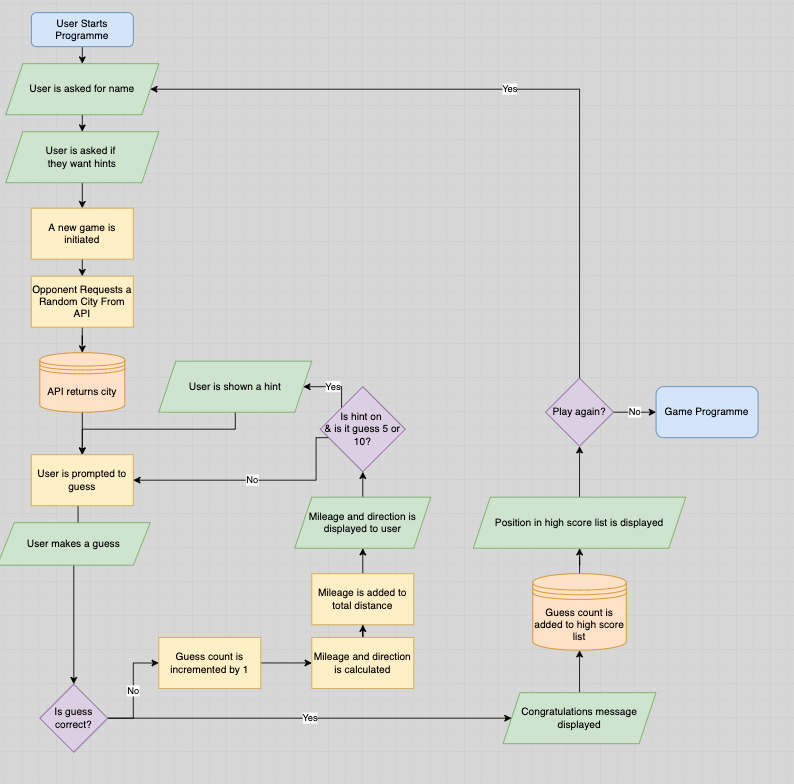
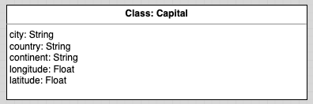
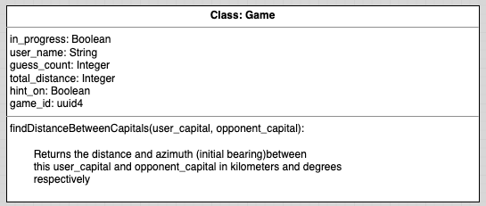

# Adventure Capital
*Adventure Capital* is a geography-based command line game written in Python.
The player is invited to guess which capital city I am hiding; if they are incorrect, I will telll them how far and in which direction they need to go, in order to find me.

This project was build as part the Full Stack Software Development course with Code Institute.

[The game is available to play in a simulated terminal.](https://denham-adventure-capital.herokuapp.com/)
## User Stories

### Game Designer
As a developed and designer for this game, I wanted to create a simple, intuitive yet enjoyable game.
The game should be immediately understandable but provide enough feedback to keep players returning to beat their previous scores, and to challange others.

The language and tone of the game should be distinctive, cheeky and informal throughout to create a sense that the player is in dialogue with the 'hiding' character.

Simple design (colour, spacing and timing) should be used to provide feedback and prompt the user for information, as well as creating a natural 'flow' to the game.

### Game Player
As a user, I want to experience an enjoyable, easy-to-learn game which will improve my lateral thinking and knowledge of the world's capitals.

The game should be complete-able on early attempts but should offer a scalable challenge that will keep me returning. I want the game to keep track of previous attempts so I can challenge myself and other players.

Any prompts or displayed information should be concise and unambiguous.

## Rules of the Game
The game is a dialogue between the player(the user) and the hider (the computer)

1. The player enters their name and decides whether they want hints to assist them
2. The hider hides - they choose a random capital city.
3. The player guesses a capital city.
    - If they are correct, they win the game.
    - If they are incorrect, the hider will them how far away they are and what direction they need to travel. The player repeats this step until they find the hider.

## Game Design

### Game Play
The logical flow of the game is essentially two loops as shown in the diagram below.

The first outer loop encourages the user remain engaged and play consecutive games. If a player decides to play again, after a successful game, they do not need to reenter their name or express a hint preference.

The inner loop represents the guess and response dialogue within the game itself - the user(player) continues to guess until locate the opponent's (hider's) city.
### Class Design
There are two classes used in this game: **Capital** and **Game**. The initial design of these classes is shown below.

**Class**

**Game**

## Features

### Input Validation
**Yes/No Answers**

When the user is prompted for a yes/no answer (show as 'y'/'n') the will be unable to preoceed until they have given the required answer. It is not case sensitive.

**Names**

Usernames cannot be empty strings or strings comprised of just spaces, but do allow letters and numbers. Non alpha-numeric characters such as punctuation or characters created by keys such as Esc are not valid. There is no currently no length limit.

### Hints
To assist with guessing more remote and lesser known capitals, the player can opt to have hints (providing the continent and country of the city) after 5 and 10 unsuccessful guesses

### Logo
The ASCII image of the world map acts as a eye-catching introduction to new players and immediately indicates the subject of the game. The original was sourced from [ASCII ART](https://ascii.co.uk/art/world) and credit belongs to *Brice Wellington from Winston Smith*.

### Colour Print
[Rich](https://rich.readthedocs.io/en/stable/introduction.html#:~:text=Rich%20is%20a%20Python%20library,in%20a%20more%20readable%20way.) is used throughout this project to add colour to key text. 
This programem uses a custom function that defines a style by keyword (eg. intro, warning etc) and prints the text to the user. This helps keep the text styling consistent by assigning a clear meaning to each type.

### Geodesic Functions
The geodesic functions (determining the distance and bearing) in this program are handled by the library [GeographicLib](https://geographiclib.sourceforge.io/html/python/code.html#module-geographiclib.geodesic)
The underlying mathematical principles are fascinating, however, and well worth a further explore. A good starting place is [here.](https://www.geeksforgeeks.org/haversine-formula-to-find-distance-between-two-points-on-a-sphere/)

### High Score
At the end of a successul game, the player will be shown the top 10 scores of all players. Scores are ranked by number of guesses (the lower the better) and then by the cumulative kilometers of error in the incorrect guesses.

The player will also be given a percentile ranking (eg. *You are better than 60% of all players*). This will add a competitive element for players who do not make the top 10.

### 'I Give Up' Functions
The player can exit the game during any guessing phase by typing "I give up". The answer will be revealed and the program will exit.

If the player uses Ctrl + C to exit the game, an exit message is shown before the program exits. If the hider has hidden, the answer will be revealed.

### Instructions
The player will be offered the chance to see instructions for the game. These explain the rules of the game and also offer further directions about exiting the game, handling capitals with diacritics and a reminder that the world is a globe.

## Upcoming Features

### Difficulty Settings
After feedback from testing, future versions will offer the user an opportunity to vary the difficulty of the game by choosing whether they the mystery location will be a well-known capital or somewhere more obscure. 

However, there is one problem to overcome before implementation. "Well-known" is a relative term and, as the developer is from Europe, likely to mean that the easy mode is more euro-centric. This may, in fact, be more difficult for players from other continents. As one of the objectives of the game is to help users better their knowledge of capital cities, it might be considered self-defeating to omit the lesser-known (again a relative term!) capitals of the world.

### Guess by Continent
Players will be able to select a continen at the start of the game; the chosen capital will then be limited to this continent, allowing users to focus their learning and game play on particular areas of the world.

The function that prepares the game (prepare_game) has already been separated from the main game play to allow this prepartory stage to get more complex and responsive to the user.

## Testing

### Validator
This program passed the [Code Institue Linter](https://pep8ci.herokuapp.com/) with no errors or warnings.

### User Testing

Thorough manual testing was completed to check that all user actions work as intended. The tables below show the results of late-stage testing. All of the tests that were found to have failed were fixed in the most recent version - details of the fixes can be found in the [Fixed Bugs](#fixed-bugs) section below.

**Programme Start**
| **User Action** | **Expected Result** | **Pass / Fail** |
|---|---|---|
| User starts programme by pressing Run Program | Welcome Title and Image is printed to page. User is asked whether they want to see the instructions | PASS |

**Prompt for Instructions**
| **User Action** | **Expected Result** | **Pass / Fail** |
|---|---|---|
| User presses 'y' or 'Y' and Enter | Instructions are printed and user is prompted for name | PASS |
| User presses 'n' or 'N' and Enter | Message of acknowledgement printed and user is prompted for name  | PASS |
| User presses any other key/keys and presses Enter | User is warned that input is invalid and prompted again | PASS |

**Prompt for Username**
| **User Action** | **Expected Result** | **Pass / Fail** |
|---|---|---|
| User enters a username comprised of alphanumeric characters  | Username is acknowledged and user is asked whether they would like hints | PASS |
| User enters a username with non-alphanumerica characters | User is warned that input is invalid and prompted again | FAIL - Programme currently accepts punctuation marks and keys such as Esc |
| User enters no username | User is warned that input is invalid and prompted again | PASS |
| User enters a username of all spaces | User is warned that input is invalid and prompted again | PASS |

**Prompt for Hints**
| **User Action** | **Expected Result** | **Pass / Fail** |
|---|---|---|
| User presses 'y' or 'Y' and Enter | Message of acknowledgement printed and game begins with invite for first guess | PASS |
| User presses 'n' or 'N' and Enter | Message of acknowledgement printed and game begins with invite for first guess| PASS |
| User presses any other key/keys and presses Enter | User is warned that input is invalid and prompted again | PASS |

**Prompt for Guess**
| **User Action** | **Expected Result** | **Pass / Fail** |
|---|---|---|
| User enters an in capital city in Title case (eg. London) | Confirmation message is displayed, dependant on whether guess is correct or not (see below) | PASS |
| User enters a capital city in Lower case (eg. budapest) | Confirmation message is displayed, dependant on whether guess is correct or not (see below) | PASS |
| User enters a capital city in Upper case (eg. ACCRA) | Confirmation message is displayed, dependant on whether guess is correct or not (see below) | PASS |
| User enters a value containing only alphabetical characters that does not appear in the database (eg. Manchester, Pancake, singing etc.) | User is warned that this is not a valid guess and invited to guess again | PASS |
| User enters a value that appears in the database but is not a capital city (eg. Spain) | User is warned that this is not a valid guess and invited to guess again | PASS |
| User enters a blank string | User is warned that this is not a valid guess and invited to guess again | PASS |
| User enters a value that has non alpha-numeric values | User is warned that this is not a valid guess and invited to guess again | PASS |

**User Makes Valid Guess**
| **User Action** | **Expected Result** | **Pass / Fail** |
|---|---|---|
| User types 'I give up' | Message of acknowledgement displayed | PASS |
|  | Answer is revealed | PASS |
|  | Program exits | PASS |
| User makes a valid but incorrect guess | User is told that answer is incorrect.   | PASS |
|  | The distance and bearing needed for the next guess. | PASS |
|  | The user is invited to guess again. | PASS |
| User makes a valid and correct guess | User is congratulated.  | PASS |
|  | Their total stats (number of guesses and cumulative distance) are displayed. | PASS |
|  | User is given a ranking as a percentage. | PASS |
|  | The top 10 scores are displayed to the screen. | PASS |
|  | The user is invited to play again. | PASS |

**KeyboardInterrupt Handling**

| **User Action** | **Expected Result** | **Pass / Fail** |
|---|---|---|
| User press Ctrl+C or equivalent during game play | Message of acknowledgement is displayed | PASS |
|  | Answer is revealed | PASS |
|  | Program exits | PASS |
| User press Ctrl+C or equivalent before or after active game play | Message of acknowledgement is displayed | PASS |
|  | Program exits | PASS |
|  |  | PASS |

### Fixed Bugs
**Invalid Guesses**

Initially testing revealed that the player was able to guess a capital city by entering the name of the country. This was due to the GSpread search funciton searching the whole worksheet rathern than a single column. This was corrected by specifying a value for the in_column parameter.

**API Failures**

On very rare occasions, an API error occurs when retrieving the details of cities from the database. Previously, this caused the game to exit abruptly with no explanation. 

The problem was very hard to replicate but through manual testing (creating a infinite loop that requested the details of the same city until the requests were blocked by Google Sheets), the developer was able to simulate this error.

A try/except block has been added which will now exit the program gracefully. A message, written in the style of the game, is displayed to the user.

**Invalid Usernames**

 Testing revealed that users could enter a username that consisted only of a blank spaces. This error would then repeat throughout the game and potentially be posted to the leaderboard.

This was corrected using the .strip() method, ensuring that all blank spaces are removed before checking the length of the entered string.

Keys that render values to the terminal but are not alphanumeric, such as the Esc key, also caused a blank-seeming username to propagate throughout the game.

This was fixed by checking using the .isalnum() method.

**Credentials**

Regrettably the service account credentials for the Google Drive API were pushed to GitHub in an early commit. This error was discovered by the developer and confirmed by Google, via email. 

The following steps were taken to ensure that the account was not compromised:
1. A review of activity via the Google Cloud Console
2. All credentials for the compromised service account was revoked. The account deleted.
3. The Google Sheet containig the data was duplicated and renamed, and the original was deleted.
4. A new service account and new credentials were generated for the new sheet.

After following these steps and taking advice from the Code Institute community, I am confident that this account remains secure.

**Countries with Multiple Capital Cities**

Several counties (notably South Africa, Bolivia, Swaziland and Tanzania) have multiple capital cities. These were added to the list on the Capital Google Sheet after feedback from players.

### Unfixed Bugs
There are currently no known unfixed bugs in this program.

## Deployment

### Git, GitHub & Gitpod
Git and GitHub were used throughout this project to assist with version control and deployment.

The following steps were followed:
1. A new Git repository was created using <code>git init</code>
2. Changes were added regularly using <code>git add .</code>
3. Changes were commited using <code>git commit -m</code> with a clear, imperative message to describe the change
4. Finally the local repository was uploaded to a remote repository (this one) using the command <code>git push</code>

To create a local copy of this project:
1. Create a folder where you want the cloned directory to be stored
2. Open your terminal and navigate to this new directory
3. In the terminal, run <code> git clone https://github.com/denham-ed/adventure_capital.git</code>

### Heroku
The program is hosted on Heroku. The following steps were followed:
1. Compiled list of dependencies by running <code>pip3 freeze > requirements.txt</code>
2. Created a new app on Heroku, selecting Europe as the region
3. In the Settings tab, under Config Vars, set up the following environment variables:
    - CREDS with value of the contents of creds.json
    - PORT with the value of 8000
4. Under Buildpacks, added build packs for deployment. This project uses:
    - Python
    - Node.js

    *The order is important here.*
5. In the Deploy tab, connected Heroku to GitHub by selecting GitHub under Deployment method
6. Searched for and selected GitHub repository name.
7. Enabled Automatic deploys - this means that every push to the main branch on GitHub will deploy a new version of this app. Alternatively, you can select a manual deploy.

## Credits

### Data Set
The list of capitals and their coordinates was sourced from [Kaggle](https://www.kaggle.com/datasets/nikitagrec/world-capitals-gps?resource=download).

Some editing was necessary to account for missing coordinates (eg. Hong Kong), areas with no capital (eg. Antarctica) and to remove diacritics (eg.Chișinău)

### Art Work
As described above, the image of the world that acts as a logo at the start of the game, in its pure text form, was sourced from [ASCII ART](https://ascii.co.uk/art/world). The original credit is ascribed to *Brice Wellington from Winston Smith*

### Libraries & Modules
**The following libraries are used in this program:**

[gspread](https://docs.gspread.org/en/v5.7.0/) is a Python API which handles the retrieving and posting of information to the Google Sheets document containing details of the capitals and the high scores.

[google-auth](https://google-auth.readthedocs.io/en/master/) is used to handle the authentication needed to access the Google Sheets document.

[Rich](https://rich.readthedocs.io/en/stable/introduction.html#:~:text=Rich%20is%20a%20Python%20library,in%20a%20more%20readable%20way.) is used to add colour to the key messages in the terminal.

[geographiclib](https://geographiclib.sourceforge.io/html/python/index.html#) is used, as described above, to solve the geodesic problems on an ellipsoid model of the earth. In this programme it is used to find the distance and azimuth between two sets of coordinates.

**From Python, the following modules are used:**

[random](https://docs.python.org/3/library/random.html) provides psuedo-random values. randint is used in this program to provide a random integer which acts as a row index from the list of capital cities. This allows the program to select a city for the player to guess.

[time](https://docs.python.org/3/library/time.html) is a module providing various time-related functions. Sleep is used in this program to delay the appearance of messages to the user; this is used purely for dramatic effect in order to build tension.

[uuid](https://docs.python.org/3/library/uuid.html) is used to provide an unique ID for each game. This allows the a game to be indentified in the list of all games, which is important for providing a percentile to the user after a successful game.

### Code
The following sources were used in the development of this programme:

[Keep Asking User for Input Until Valid](https://bobbyhadz.com/blog/python-keep-asking-for-user-input-until-valid#:~:text=To%20keep%20asking%20for%20user,break%20out%20of%20the%20loop.)

An adapted version of this looping pattern is used throughout the programme (asking for hints, asking for username, asking for a guess).

[How to Sort Objects by Multiple Keys](https://stackoverflow.com/questions/1143671/how-to-sort-objects-by-multiple-keys)

Scott Stafford's answer provides the basis for the function used to sort high scores (by number of guesses and by distance).

[Convert Integers to Ordinal Numbers](https://codereview.stackexchange.com/questions/41298/producing-ordinal-numbers)

Winston Ewert's solution is used in full to show the prompt the user for their 1st, 2nd, 3rd etc guess.

[Python Looping with Index Counters](https://datagy.io/python-enumerate/)

This technique is utilised to efficiently provide an index when printing the top 10 high scores to the user after a successful game.

[Search List of Dictionaries](https://stackoverflow.com/questions/8653516/python-list-of-dictionaries-search)

This was used to indentify the current game in the list of all games in order to provide a positional ranking as a percentage to the player.

[String Validators](https://www.hackerrank.com/challenges/string-validators/problem)

The explanations of the built in string methods was extremely useful in fixing the validation of the username.

***Any code that is replicated verbatim from any source is also credited above the code itself in run.py.***

### Other Resources and Technologies

[Code Beautify](https://codebeautify.org/python-formatter-beautifier) was used to assist in the formatting and checking of the run.py file.

[Draw.io](https://app.diagrams.net/) was used to produce the flow charts and class diagrams at the top of this document.

[Tables Generator](https://www.tablesgenerator.com/markdown_tables#) was used to create the framework for the testing tables, above.

### Acknowledgements
- The support of my mentor Spencer Barriball for his advice, guidance and directions to resources is gratefully acknowledged.

- The Code Institute example read me was used as a template for this document.

- The [Code Institue Python Essentials Repo](https://github.com/Code-Institute-Org/python-essentials-template) was used as a template for this project to allow for it to be run on the simulated terminal in the live link above.