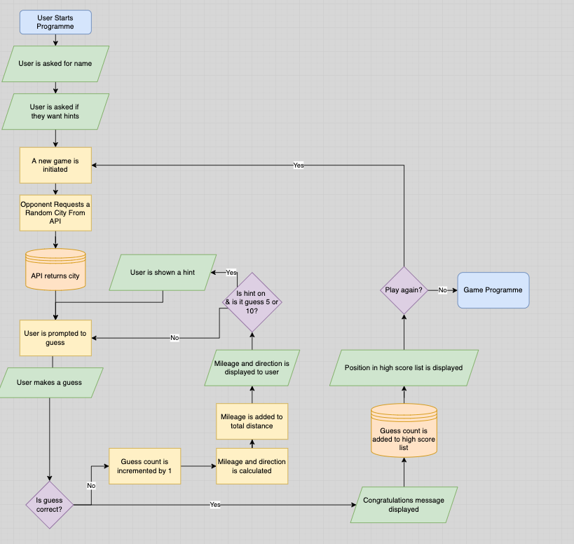

# Where Am I Hiding?
*Where Am I Hiding?* is a command line game written in Python.
The player is invited to guess which capital city I am hiding; if they are incorrect, I will telll them how far and in which direction they need to go, in order to find me.

This project was build as part the Full Stack Software Development course with Code Institute.
## User Stories

### Game Designer
As a developed and designer for this game, I wanted to create a simple, intuitive yet enjoyable game.
The game should be immediately understandable but provide enough feedback to keep players returning to beat their previous scores, and to challange others.

The language and tone of the game should be distinctive, cheeky and informal throughout to create a sense that the player is in dialogue with the 'hiding' character.

Simple design (colour, spacing and timing) should be used to provide feedback and prompt the user for information, as well as creating a natural 'flow' to the game.

### Game Player
As a user, I want to experience an enjoyable, easy-to-learn game which will improve my lateral thinking and knowledge of the world's capitals.

The game should be complete-able on early attempts but should offer a scalable challenge that will keep me returning. I want the game to keep track of previous attempts so I can challenge myself and other players.

Any prompts or displayed information should be concise and unambiguous.

## Rules of the Game
The game is a dialogue between the player(the user) and the hider (the computer)

1. The player enters their name and decides whether they want hints to assist them
2. The hider hides - they choose a random capital city.
3. The player guesses a capital city.
    - If they are correct, they win the game.
    - If they are incorrect, the hider will them how far away they are and what direction they need to travel. The player repeats this step until they find the hider.

## Game Design

### Game Play
The flow of the game is essentially one large loop

### Class Design

## Features ??

## Upcoming Features

### Username

### Toggle Hints

### User Guess

## Testing

### Validation

### User Testing (Table etc)

### Fixed Bugs

### Unfixed Bugs

## Deployment

## Credits

### Libraries

### Code

### Acknowledgements
